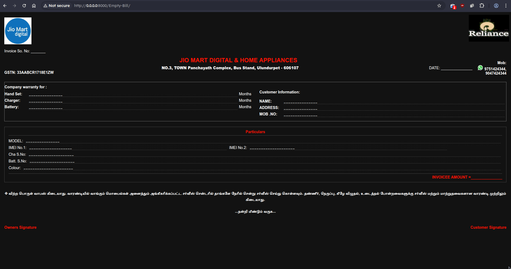
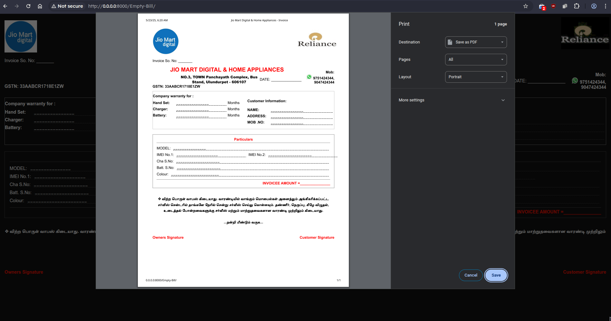
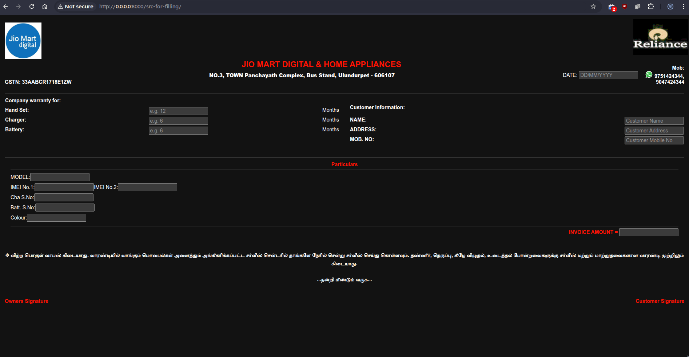
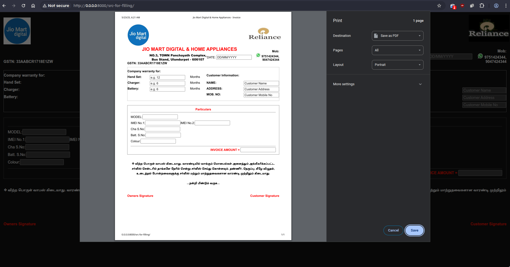

# JioMart Ulundurpet Billing System.

## Output from Empty Bill:

## Output from Source for Filling:

## Dev = Normi
These codes was maintained by [**iamNormi**](https://github.com/iamNormi).

 |
--- |
[iamNormi](https://github.com/iamNormi) |

## License

[GNU GENERAL PUBLIC LICENSE](./LICENSE)

